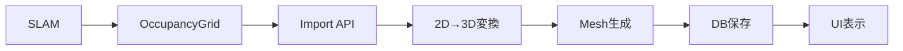
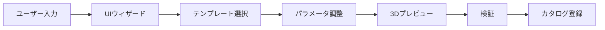
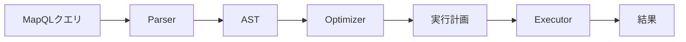

# システムアーキテクチャ

## 概要

Semantic Map Platform は、RoboCup@Home DSPL向けに設計された、ロボットの認識負荷を削減するための意味地図・操作カタログ統合プラットフォームです。

## システム構成

```
┌────────────────────────────────────────────────────────┐
│                    User Interface Layer                │
│  ┌──────────────────────────────────────────────────┐  │
│  │  React App (Frontend)                            │  │
│  │  - 3D Map Editor (Three.js)                      │  │
│  │  - Operation Catalog Manager                     │  │
│  │  - MapQL Query Builder                           │  │
│  └──────────────────────────────────────────────────┘  │
└────────────────────────────────────────────────────────┘
                              ↕
┌────────────────────────────────────────────────────────┐
│                    API Gateway Layer                   │
│  ┌──────────────────────────────────────────────────┐  │
│  │  Express.js REST API                             │  │
│  │  - /api/maps      - /api/operations              │  │
│  │  - /api/query     - /api/catalog                 │  │
│  └──────────────────────────────────────────────────┘  │
│  ┌──────────────────────────────────────────────────┐  │
│  │  WebSocket Server (Real-time Updates)            │  │
│  └──────────────────────────────────────────────────┘  │
└────────────────────────────────────────────────────────┘
                              ↕
┌────────────────────────────────────────────────────────┐
│                  Business Logic Layer                  │
│  ┌─────────────┬───────────────┬───────────────────┐   │
│  │  Map Core   │  MapQL Engine │  Operation Catalog│   │
│  │  - 3D Gen   │  - Parser     │  - CRUD           │   │
│  │  - Semantic │  - Optimizer  │  - Templates      │   │
│  │  - Import   │  - Executor   │  - Validation     │   │
│  └─────────────┴───────────────┴───────────────────┘   │
└────────────────────────────────────────────────────────┘
                              ↕
┌────────────────────────────────────────────────────────┐
│                    Data Storage Layer                  │
│  ┌─────────────┬───────────────┬───────────────────┐   │
│  │  SQLite DB  │  File System  │  Cache (Redis)    │   │
│  │  - Maps     │  - Meshes     │  - Query Results  │   │
│  │  - Catalog  │  - Textures   │  - Sessions       │   │
│  └─────────────┴───────────────┴───────────────────┘   │
└────────────────────────────────────────────────────────┘
                              ↕
┌────────────────────────────────────────────────────────┐
│                    Integration Layer                   │
│  ┌──────────────────────────────────────────────────┐  │
│  │  ROS Bridge                                      │  │
│  │  - rosbridge_server (WebSocket)                  │  │
│  │  - Topics: /semantic_map, /operation_status      │  │
│  │  - Services: /mapql_query, /execute_operation    │  │
│  └──────────────────────────────────────────────────┘  │
└────────────────────────────────────────────────────────┘
```

## コンポーネント詳細

### 1. Frontend (React + Three.js)

**責務**: ユーザーインタラクションと3D可視化

```typescript
// 主要コンポーネント構成
src/
├── components/
│   ├── MapEditor/        # 2D/3D地図編集
│   ├── CatalogManager/   # 操作定義UI
│   ├── QueryBuilder/     # MapQLビルダー
│   └── Visualizer/       # 実行状態表示
├── hooks/
│   ├── useMapData()      # 地図データ管理
│   ├── useOperations()   # 操作カタログ
│   └── useROS()          # ROS連携
└── api/
    └── client.ts         # APIクライアント
```

### 2. Backend API (Express.js)

**責務**: ビジネスロジックの調整とデータ永続化

```typescript
// エンドポイント構成
/api/
├── /maps
│   ├── GET    /           # 地図一覧
│   ├── POST   /           # 新規作成
│   ├── GET    /:id        # 地図取得
│   ├── PUT    /:id        # 更新
│   └── POST   /:id/query  # MapQLクエリ
├── /operations
│   ├── GET    /           # カタログ一覧
│   ├── POST   /           # 新規登録
│   ├── GET    /:id        # 仕様取得
│   └── PUT    /:id        # 更新
└── /catalog
    ├── GET    /templates  # テンプレート
    └── POST   /import     # 一括インポート
```

### 3. Core Packages

#### 3.1 Map Core (`packages/core`)

**2D→3D変換エンジン**:

```typescript
class MapGenerator {
  // OccupancyGridから3Dメッシュ生成
  generateMesh(occupancyGrid: OccupancyGrid): Mesh {
    // 1. 壁境界検出
    const boundaries = detectWallBoundaries(occupancyGrid);
    
    // 2. ポリゴン化
    const polygons = createPolygons(boundaries);
    
    // 3. 押し出し
    const mesh = extrudePolygons(polygons, height);
    
    return mesh;
  }
}
```

#### 3.2 MapQL Engine (`packages/mapql`)

**クエリ言語処理**:

```javascript
// PEG.js文法定義（抜粋）
Query = SelectQuery / GetQuery / FindQuery

FindQuery = "FIND" _ Type _ WhereClause? _ OrderClause? _ LimitClause?

WhereClause = "WHERE" _ Condition

Condition = AndCondition / OrCondition / Comparison
```

**実行エンジン**:

```typescript
class QueryExecutor {
  async execute(ast: AST): Promise<QueryResult> {
    // 1. 実行計画生成
    const plan = this.optimizer.createPlan(ast);
    
    // 2. インデックス活用
    const candidates = await this.indexer.getCandidates(plan);
    
    // 3. フィルタ適用
    const results = this.filter(candidates, plan.conditions);
    
    return results;
  }
}
```

#### 3.3 Operation Catalog (`packages/catalog`)

**カタログ管理**:

```typescript
class CatalogService {
  // 操作仕様取得
  async getOperation(id: string): Promise<OperationSpec> {
    const spec = await this.repository.findById(id);
    
    // バリデーション
    this.validator.validate(spec);
    
    // デフォルト値補完
    return this.enrichWithDefaults(spec);
  }
  
  // テンプレート適用
  applyTemplate(
    templateId: string, 
    params: CustomParams
  ): OperationSpec {
    const template = this.templates.get(templateId);
    return mergeDeep(template, params);
  }
}
```

### 4. ROS Bridge

**ROS統合**:

```python
#!/usr/bin/env python3
import rospy
from semantic_map.srv import MapQLQuery, ExecuteOperation

class SemanticMapBridge:
    def __init__(self):
        # サービス登録
        self.query_srv = rospy.Service(
            '/mapql_query', 
            MapQLQuery, 
            self.handle_query
        )
        
        # トピック配信
        self.map_pub = rospy.Publisher(
            '/semantic_map',
            SemanticMap,
            queue_size=1,
            latch=True
        )
    
    def handle_query(self, req):
        # APIサーバーに転送
        result = self.api_client.query(req.query)
        return MapQLQueryResponse(
            success=result.success,
            data=json.dumps(result.data)
        )
```

## データフロー

### 1. 地図作成フロー



### 2. 操作定義フロー



### 3. クエリ実行フロー



## 技術スタック

### Backend

- **Runtime**: Node.js 18+ (LTS)
- **Framework**: Express.js 4.x
- **Language**: TypeScript 5.x
- **Database**: SQLite3 (開発) / PostgreSQL (本番)
- **ORM**: Prisma
- **Validation**: Ajv (JSON Schema)
- **Testing**: Jest + Supertest

### Frontend

- **Framework**: React 18
- **Build Tool**: Vite 5
- **Language**: TypeScript
- **3D Graphics**: Three.js + React Three Fiber
- **State**: Zustand
- **UI Library**: Radix UI + Tailwind CSS
- **Testing**: Vitest + Testing Library

### Infrastructure

- **Container**: Docker + Docker Compose
- **ROS Bridge**: rosbridge_suite
- **Cache**: Redis (optional)
- **Process Manager**: PM2
- **Monitoring**: Prometheus + Grafana (optional)

## デプロイメント

### 開発環境

```bash
# Docker Composeで起動
docker-compose up -d

# サービス確認
- Frontend: http://localhost:5173
- Backend: http://localhost:3000
- ROS Bridge: ws://localhost:9090
```

### 本番環境

```yaml
# docker-compose.production.yml
version: '3.8'

services:
  backend:
    image: semantic-map/backend:latest
    environment:
      - NODE_ENV=production
      - DATABASE_URL=${DATABASE_URL}
    ports:
      - "3000:3000"
    
  frontend:
    image: semantic-map/frontend:latest
    ports:
      - "80:80"
    
  postgres:
    image: postgres:15
    volumes:
      - pgdata:/var/lib/postgresql/data
```

## パフォーマンス最適化

### 1. クエリ最適化

```typescript
// インデックス戦略
class IndexManager {
  indices = {
    spatial: new RTree(),     // 空間インデックス
    type: new Map(),          // タイプ別
    location: new Map(),      // 場所別
  };
  
  async query(conditions: Condition[]): Promise<Entity[]> {
    // 最も選択的な条件から評価
    const sorted = this.sortBySelectivity(conditions);
    
    // インデックスマージ
    return this.mergeResults(sorted);
  }
}
```

### 2. 3D最適化

```typescript
// LOD (Level of Detail)
class MeshOptimizer {
  optimize(mesh: Mesh): OptimizedMesh {
    // 1. 頂点削減
    const simplified = this.simplify(mesh, 0.5);
    
    // 2. テクスチャアトラス
    const atlased = this.createAtlas(simplified);
    
    // 3. インスタンシング
    return this.instanceDuplicates(atlased);
  }
}
```

### 3. キャッシュ戦略

```typescript
// 多層キャッシュ
class CacheManager {
  layers = {
    memory: new LRUCache({ max: 100 }),
    redis: new RedisCache(),
    cdn: new CDNCache(),
  };
  
  async get(key: string): Promise<any> {
    // ウォーターフォール
    for (const layer of Object.values(this.layers)) {
      const value = await layer.get(key);
      if (value) return value;
    }
    return null;
  }
}
```

## セキュリティ

### 認証・認可

```typescript
// JWT認証（将来実装）
app.use('/api/admin', authenticateJWT);
app.use('/api/maps/:id/edit', authorizeMapEdit);
```

### 入力検証

```typescript
// スキーマ検証
const operationSchema = {
  type: 'object',
  required: ['id', 'type', 'operation_spec'],
  properties: {
    id: { type: 'string', pattern: '^[a-z0-9_]+$' },
    // ...
  }
};

ajv.compile(operationSchema);
```

## 監視とログ

### メトリクス

```typescript
// Prometheusメトリクス
const metrics = {
  query_duration: new Histogram({
    name: 'mapql_query_duration_seconds',
    help: 'MapQL query execution time',
  }),
  
  operation_success: new Counter({
    name: 'operation_executions_total',
    help: 'Total operation executions',
  }),
};
```

### ロギング

```typescript
// 構造化ログ
logger.info('Operation executed', {
  operation_id: 'kitchen_door',
  duration_ms: 3420,
  success: true,
  robot_id: 'hsr_001',
});
```

## 拡張ポイント

### プラグインアーキテクチャ

```typescript
// カスタムオペレーション追加
class PluginManager {
  register(plugin: Plugin) {
    this.plugins.set(plugin.name, plugin);
    
    // フック登録
    plugin.hooks?.forEach(hook => {
      this.hookManager.register(hook);
    });
  }
}
```

### イベント駆動

```typescript
// イベントバス
eventBus.on('operation:completed', async (event) => {
  // 統計更新
  await stats.increment('operations', event.operation_id);
  
  // 通知
  await notifier.send('Operation completed', event);
});
```

## 今後の拡張予定

1. **機械学習統合**: 操作パラメータの自動調整
2. **マルチロボット対応**: 複数HSRでの情報共有
3. **クラウド同期**: チーム間でのカタログ共有
4. **AR/VR対応**: HoloLensでの編集機能
